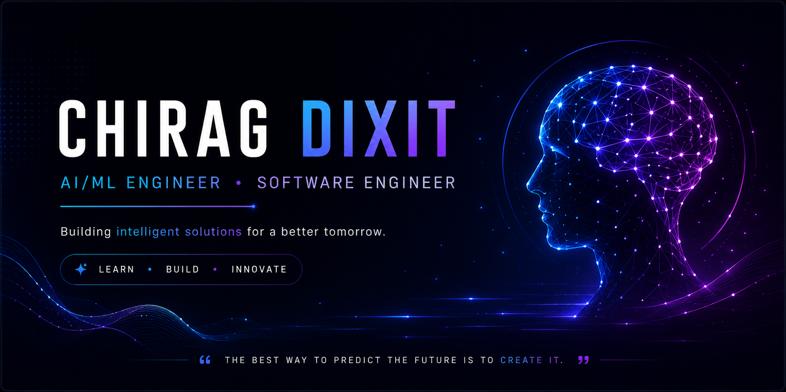
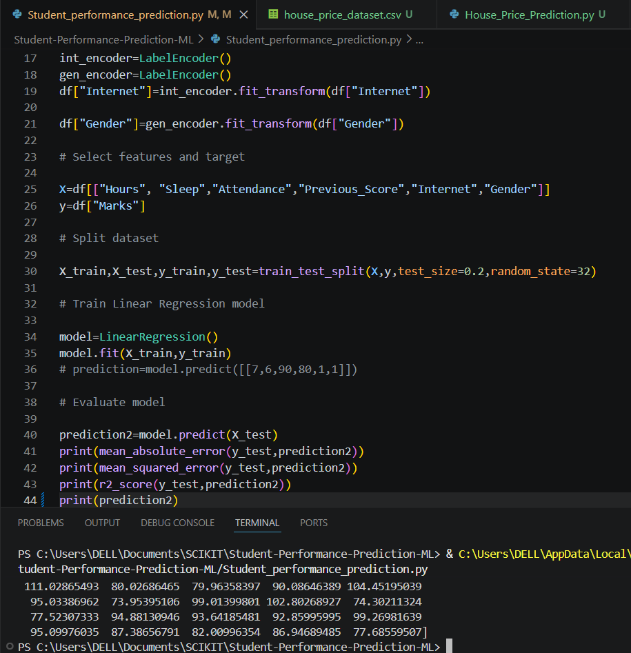
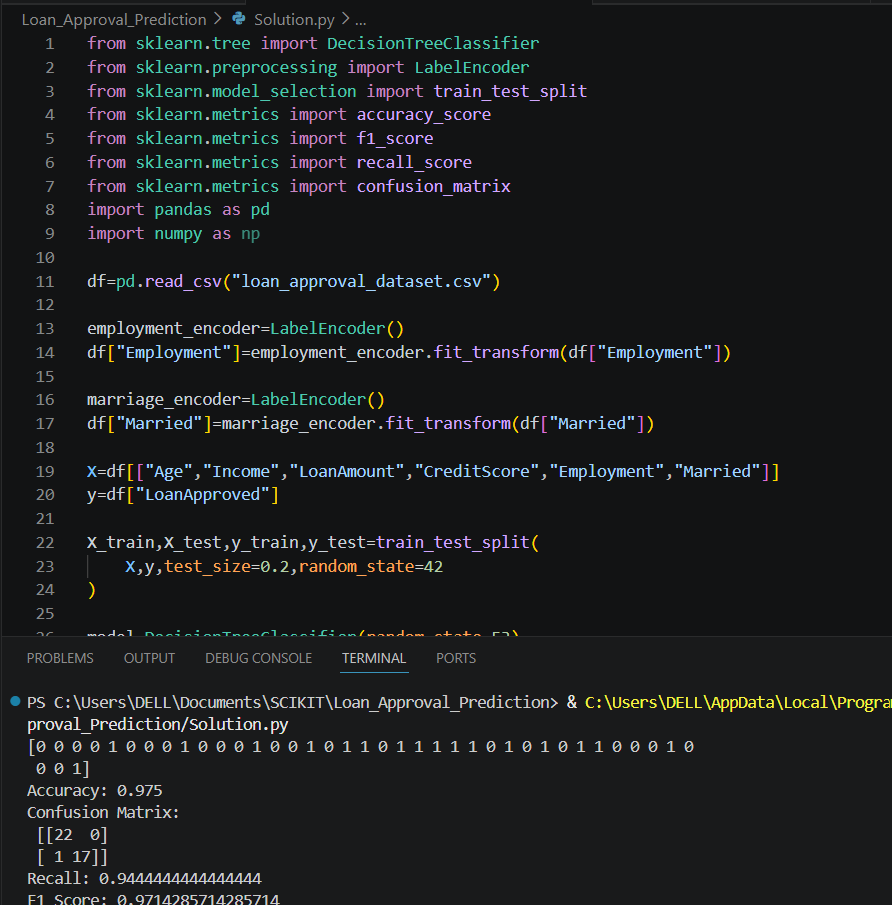
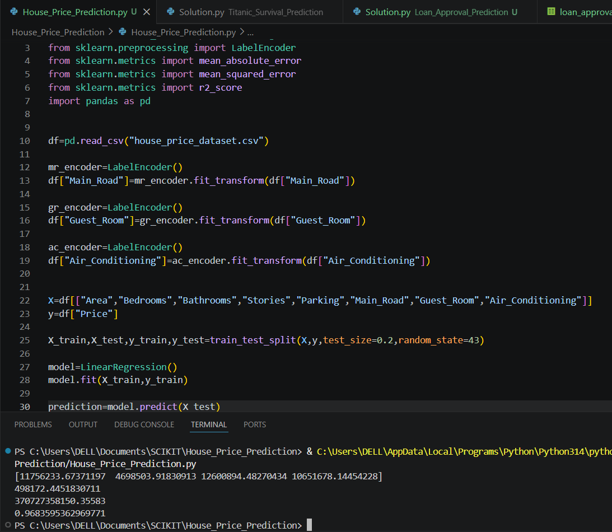
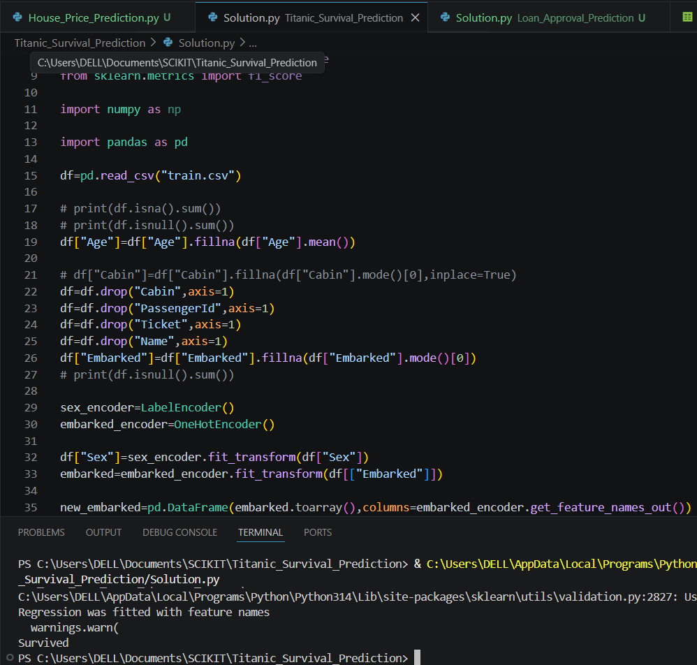

<div align="center">

<p align="center">
  
</p>
<h2 align="center">
  👋 Welcome to my GitHub Profile!
</h2>

<p align="center">
  
</p>

<p align="center">
💻 Turning ideas into intelligent solutions with AI, Machine Learning, and Software Development.
</p>


<p>


</p>

<p>

<a href="https://github.com/chiragdixit13">

</a>

<a href="mailto:chiragdixit320@gmail.com">

</a>

<a href="https://linkedin.com/in/YOUR-LINKEDIN">

</a>

</p>

</div>

---

# 🚀 About Me

I'm **Chirag Dixit**, an aspiring AI & Machine Learning Engineer with a passion for solving real-world problems through technology. I enjoy transforming ideas into practical solutions, continuously learning, and building projects that create meaningful impact.

## 💫 A Little About Me

- 🎓 B.Tech Computer Science Graduate
- 💻 Software Engineer
- 🤖 Aspiring AI & Machine Learning Engineer
- 📊 Passionate about Data Analytics
- 🌱 Currently learning Deep Learning and Generative AI
- 🚀 Building practical Machine Learning projects
- ⚡ Strong foundation in Python, Java and DSA
- 📚 Love learning new technologies every day

---
## 🌱 Currently Working On

<table>
<tr>
<td>

- 🤖 Deep Learning
- 🧠 TensorFlow
- 🔥 PyTorch
- 🎨 Generative AI

</td>
<td>

- 📊 Machine Learning Projects
- 💻 Python Development
- 🚀 DSA Practice
- 🌍 Open Source Contributions

</td>
</tr>
</table>

# 💻 Tech Stack

## 👨‍💻 Languages

<p align="center">


</p>

---

## 🤖 Machine Learning

<p align="center">


</p>

---

## ⚙️ Tools

<p align="center">


</p>

---

## 📌 Profile Summary

<p align="center">
  
</p>

## 🚀 Featured Projects

### 🎓 Student Performance Prediction



Machine Learning model to predict student marks using Linear Regression.
⭐ **Repository**

[Open Project](https://github.com/chiragdixit13/Student-Performance-Prediction-ML)

---

### 🏦 Loan Approval Prediction



Decision Tree model for loan approval prediction.
⭐ **Repository**

[Open Project](https://github.com/chiragdixit13/Loan-Approval-Prediction)

---

### 🏠 House Price Prediction



Predict house prices using Machine Learning.
⭐ **Repository**

[Open Project](https://github.com/chiragdixit13/House-Price-Prediction)

---

### 🚢 Titanic Survival Prediction



Predict Titanic passenger survival using classification models.
⭐ **Repository**

[Open Project](https://github.com/chiragdixit13/Titanic-Survival-Prediction-ML)

## 📊 Sales Data Analysis Dashboard

Visualized business insights using Python.

**Libraries**

- Pandas
- Matplotlib
- Seaborn

⭐ **Repository**

[Open Project](YOUR_REPOSITORY_LINK)

</td>

<td width="50%">

## 🌦 Weather Data Visualization

Data visualization project for weather analysis.

⭐ **Repository**

[Open Project](YOUR_REPOSITORY_LINK)

</td>

</tr>

<tr>

<td width="50%">

## 🛒 E-Commerce Web Application

React based shopping platform.

**Tech Stack**

React

JavaScript

HTML

CSS

MySQL

⭐ **Repository**

[Open Project](YOUR_REPOSITORY_LINK)

</td>

<td width="50%">

## 📚 Smart Library Management System

Desktop application developed using Java.

⭐ **Repository**

[Open Project](YOUR_REPOSITORY_LINK)

</td>

</tr>

</table>

---

# 🌱 Currently Learning

```text
███████████████░░░░░░░  Machine Learning

███████████░░░░░░░░░░░  Deep Learning

████████░░░░░░░░░░░░░░ TensorFlow

███████░░░░░░░░░░░░░░░ PyTorch

█████░░░░░░░░░░░░░░░░░ Generative AI
```

---

# 🎯 2026 Goals

- ✅ Master Python
- ✅ Build AI Projects
- ⏳ Learn Deep Learning
- ⏳ Learn TensorFlow
- ⏳ Learn PyTorch
- ⏳ Contribute to Open Source
- ⏳ Crack an AI/ML Engineer role

---


## 🐍 Contribution Snake

<p align="center">
  
</p>


---

# 🌍 3D Contribution Calendar

> This section will become active after we add the workflow.

---

# 📫 Connect With Me

<p align="center">

<a href="https://github.com/chiragdixit13">

</a>

<a href="mailto:chiragdixit320@gmail.com">

</a>

<a href="https://linkedin.com/in/chiragdixit13">

</a>

</p>

---

# 💬 Favorite Quote

> **"The best way to predict the future is to build it."**

---

<div align="center">

## ⭐ Thanks for visiting my profile!

If you like my work, don't forget to ⭐ my repositories.


</div>
